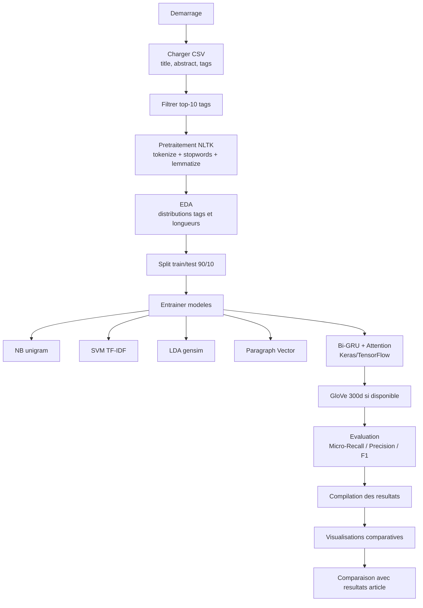

# projet_session

Reproduction simplifiee de l'article **Semantic-based Tag Recommendation in Scientific Bookmarking Systems**.

Source article: [https://dl.acm.org/doi/pdf/10.1145/3240323.3240409](https://dl.acm.org/doi/pdf/10.1145/3240323.3240409)

## Stack (alignee article)

- Python
- Keras + TensorFlow backend
- NLTK (tokenization, stopwords, lemmatization)
- scikit-learn (NB, SVM, classification multi-label)
- gensim (LDA, Paragraph Vector)

## Structure

- `notebooks/tag_reco_experiment.ipynb`: notebook principal.
- `src/data.py`: chargement/preparation des donnees.
- `src/models.py`: entrainement des modeles.
- `src/experiment.py`: orchestration des experiences.
- `src/visualization.py`: **toutes les visualisations** (sorties du notebook).
- `data/citeulike_top10.csv`: jeu de donnees CSV simple (exemple).
- `scripts/run_experiment_cli.py`: execution hors notebook, sortie des metriques dans le terminal.

## Format de donnees attendu (simple)

Un seul CSV avec colonnes:

- `title`
- `abstract`
- `tags` (separees par `|`, ex: `nlp|deep learning|attention`)

Le notebook importe les donnees en **une cellule** via `DATA_PATH`.

## GloVe (optionnel mais recommande)

Le modele Bi-GRU+Attention cherche le fichier:

- `data/glove.6B.300d.txt`

S'il est absent, le notebook reste executable avec un embedding aleatoire (fallback simple).

## Lancer avec Docker (NVIDIA TensorFlow base)

Prerequis:

- Docker + plugin compose
- NVIDIA Container Toolkit (si GPU)

Commandes:

```bash
docker compose build
docker compose up
```

Puis ouvrir Jupyter Lab: `http://localhost:8888`.

## Lancer en local avec venv

```bash
python -m venv .venv
source .venv/bin/activate
pip install -r requirements.txt
jupyter lab
```

## Execution hors notebook (terminal)

```bash
python scripts/run_experiment_cli.py
```

Options utiles:

```bash
python scripts/run_experiment_cli.py --data-path data/citeulike_top10.csv --glove-path data/glove.6B.300d.txt --top-k-tags 10 --test-size 0.1 --seed 42
```

## Workflow notebook

1. Regler `DATA_PATH` dans la cellule de parametres.
2. Optionnel: regler `GLOVE_PATH` vers `data/glove.6B.300d.txt`.
3. Executer les cellules dans l'ordre.
4. La derniere cellule compile les metriques et affiche:
   - comparaison des modeles courants
   - comparaison avec les resultats de l'article.

## Logigramme de l'experience

