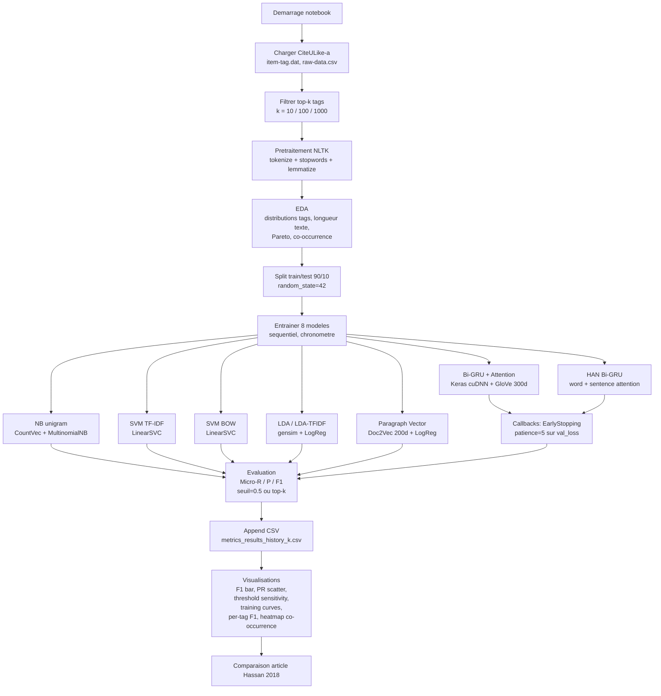

# Semantic-based Tag Recommendation — reproduction pédagogique

Reproduction et extension de l'article [**Semantic-based Tag Recommendation in Scientific Bookmarking Systems**](https://dl.acm.org/doi/pdf/10.1145/3240323.3240409) (Hassan, Sansonetti, Micarelli, Esposito, Beel — RecSys 2018), dans le cadre du cours **Web sémantique** à l'UQO (session hiver 2026).

L'objectif est de comparer, sur le jeu **CiteULike-a**, les modèles classiques (Naive Bayes, SVM, LDA, Paragraph Vector / Doc2Vec) à un modèle neuronal **Bi-GRU + Attention** (non-hiérarchique et hiérarchique / HAN), pour la recommandation multi-label de tags à partir du texte (titre + résumé) d'articles scientifiques.

---

## Sommaire

- [Stack technique](#stack-technique)
- [Jeu de données](#jeu-de-données)
- [Structure du projet](#structure-du-projet)
- [Démarrage rapide — Docker GPU](#démarrage-rapide--docker-gpu-recommandé)
- [Démarrage alternatif — venv local](#démarrage-alternatif--venv-local-cpu-ou-gpu)
- [Exécution sans notebook (CLI)](#exécution-sans-notebook-cli)
- [Workflow notebook](#workflow-notebook)
- [Résultats](#résultats)
- [Notes d'implémentation — RTX 50xx / Blackwell (sm_120)](#notes-dimplémentation--rtx-50xx--blackwell-sm_120)
- [Dépannage](#dépannage)
- [Logigramme de l'expérience](#logigramme-de-lexpérience)

---

## Stack technique

Aligné avec l'article, mais mis à jour aux versions actuelles :

- **Python 3.12** (Ubuntu 24.04 LTS)
- **TensorFlow 2.22** + **Keras 3** — compilé depuis les sources pour `sm_120` (Blackwell) ; voir [Notes d'implémentation](#notes-dimplémentation--rtx-50xx--blackwell-sm_120)
- **PyTorch nightly cu128** (Blackwell-ready) — fourni dans l'image pour compléter le stack ML
- **NLTK** — tokenisation, stopwords, lemmatisation WordNet
- **scikit-learn** — Naive Bayes, LinearSVC, vectorisation TF-IDF / BOW, multi-label
- **gensim** — LDA, Doc2Vec (Paragraph Vector)
- **matplotlib / seaborn** — visualisations
- **Jupyter Lab** — notebook principal

### GPU supporté

Le `Dockerfile.gpu` compile TensorFlow pour la capacité compute **12.0 (Blackwell, RTX 50xx)**. Pour un autre GPU (Ampere 8.0, Ada 8.9, Hopper 9.0…), modifier `HERMETIC_CUDA_COMPUTE_CAPABILITIES` dans `.tf_configure.bazelrc`.

---

## Jeu de données

**CiteULike-a** (Wang & Blei, 2011) — 16 980 articles scientifiques, chacun annoté par plusieurs tags utilisateurs.

Fichiers `.dat` et `raw-data.csv` déjà présents dans `data/citeulike-a/`.

Schéma aplati (construit à la volée par `src.data.load_citeulike_a_dataset`) :

| champ      | type | description                                |
|------------|------|--------------------------------------------|
| `title`    | str  | titre de l'article                         |
| `abstract` | str  | résumé                                     |
| `tags`     | str  | tags séparés par `\|` (ex: `nlp\|gru\|attention`) |

Vous pouvez aussi lui donner un CSV simple avec les mêmes colonnes via la loader `load_simple_dataset`.

### GloVe (recommandé)

Les deux modèles neuronaux cherchent par défaut `data/glove.6B.300d.txt`. Téléchargement : <https://nlp.stanford.edu/projects/glove/> (archive `glove.6B.zip`, 822 MB, contient également les dimensions 50/100/200).

Sans GloVe, les modèles neuronaux tournent quand même avec une matrice d'embeddings **entraînable** initialisée aléatoirement (qualité dégradée).

---

## Structure du projet

```
projet_session/
├── articles/                      # PDF de référence (Hassan 2018, Wang-Blei 2011, etc.)
├── data/
│   ├── citeulike-a/               # dataset brut (item-tag.dat, tags.dat, raw-data.csv…)
│   ├── glove.6B.{50,100,200,300}d.txt
│   └── metrics_results_history*.csv  # historique des runs (auto-append)
├── scripts/
│   ├── run_experiment_cli.py      # lance toute la pipeline depuis un terminal
│   └── run_experiment.py          # variante d'orchestration
├── src/
│   ├── data.py                    # chargement + prétraitement NLTK
│   ├── models.py                  # NB, SVM, LDA, Doc2Vec, BiGRU+Att, HAN
│   ├── experiment.py              # orchestration train_all / évaluation
│   ├── visualization.py           # toutes les figures du notebook
│   └── results_save.py            # append d'une ligne dans metrics_results_history.csv
├── tag_reco_experiment.ipynb      # notebook principal (bout-en-bout)
├── Dockerfile.gpu                 # image multi-stage TF-from-source + PyTorch cu128
├── Dockerfile                     # fallback CPU minimal
├── docker-compose.yml
├── .tf_configure.bazelrc          # config Bazel pour la compilation TF (sm_120, CUDA 12.8, cuDNN 9.8)
├── startup.sh                     # entrypoint (info box + exec "$@")
├── test_gpu.py                    # sanity check GPU (PyTorch + TF)
└── requirements.txt               # deps CPU fallback (venv local)
```

### Modèles implémentés (dans `src/models.py`)

| clé                 | approche                                                       | entrée texte |
|---------------------|----------------------------------------------------------------|--------------|
| `NB`                | CountVectorizer + MultinomialNB (one-vs-rest)                  | flat         |
| `SVM`               | TfidfVectorizer + LinearSVC (one-vs-rest)                      | flat         |
| `SVM_BOW`           | CountVectorizer + LinearSVC                                    | flat         |
| `LDA`               | gensim LDA (BoW) + régression logistique sur topic-dist        | flat         |
| `LDA_TFIDF`         | gensim LDA sur corpus TF-IDF + régression logistique           | flat         |
| `Paragraph Vector`  | gensim Doc2Vec (vector_size=200) + régression logistique       | flat         |
| `Bi-GRU+Att`        | Keras Bi-GRU + attention additive temporelle (GloVe 300d)      | flat         |
| `HAN_BiGRU_Att`     | Hierarchical Attention Network (word + sentence level, Bi-GRU) | hiérarchique |

---

## Démarrage rapide — Docker GPU (recommandé)

### Prérequis

- **Docker** + plugin `docker compose`
- **NVIDIA Container Toolkit** (nécessaire pour `--gpus`)
- **Driver NVIDIA ≥ 560** (Blackwell)
- ~15 GB libres (image finale ~11 GB + cache Bazel)

### Build

> ⚠️ Le premier build recompile **TensorFlow depuis les sources** pour `sm_120`. Comptez **~50 min sur un laptop 16-core**. Les builds suivants réutilisent le cache Bazel (monté en volume BuildKit) → quelques secondes si rien n'a changé côté TF.

```bash
docker build -f Dockerfile.gpu -t semantic_tag_notebook_gpu .
```

Le `docker-compose.yml` référence l'image `semantic_tag_notebook_gpu` directement (build commenté pour itérer).

### Lancement

```bash
docker compose up
```

Jupyter Lab écoute sur `http://localhost:8891` (token `websem`). Les dossiers du projet sont montés en volume dans `/workspace`, donc toute modification de code est immédiate.

### Vérification GPU

Un sanity-check est exécuté au démarrage (voir `startup.sh`) ; sortie typique :

```
CUDA Runtime: 12.8
Python: Python 3.12.3
PyTorch: 2.12.0.dev...+cu128 (nightly)
PyTorch CUDA: Yes (for 1 GPUs)
TensorFlow: 2.22.0-dev0+selfbuilt
NVIDIA GeForce RTX 5090, 32607 MiB, compute_cap 12.0
```

Vous pouvez aussi lancer explicitement `docker exec -it <container> python /workspace/test_gpu.py`.

---

## Démarrage alternatif — venv local (CPU ou GPU)

Pour un développement rapide sans compiler TF ou si vous n'avez pas de GPU Blackwell :

```bash
python3 -m venv .venv
source .venv/bin/activate
pip install -r requirements.txt
pip install tensorflow  # ou tf-nightly si GPU Ada/Hopper/Ampere
pip install jupyter
jupyter lab
```

Sur GPU antérieur à Blackwell, `pip install tensorflow[and-cuda]` suffit (sm_120 n'est pas requis).

---

## Exécution sans notebook (CLI)

```bash
python scripts/run_experiment_cli.py \
    --data-path data/citeulike-a \
    --glove-path data/glove.6B.300d.txt \
    --top-k-tags 10 \
    --test-size 0.1 \
    --seed 42
```

Sortie : table des métriques (micro-R / micro-P / micro-F1) triée par F1, plus le meilleur modèle.

---

## Workflow notebook

1. Ouvrir `tag_reco_experiment.ipynb` depuis Jupyter Lab.
2. Dans la cellule de paramètres :
   - `DATA_PATH = "data/citeulike-a"` (ou votre CSV simple)
   - `GLOVE_PATH = "data/glove.6B.300d.txt"`
   - `TOP_K_TAGS = 10` (ou 100 / 1000 pour des expériences plus larges)
3. Exécuter les cellules dans l'ordre.
4. Les dernières cellules produisent :
   - table comparative des métriques par modèle ;
   - courbes d'apprentissage Keras (loss / val_loss) ;
   - F1 par tag (Bi-GRU vs article) ;
   - heatmap de co-occurrence des tags ;
   - scatter Precision / Recall ;
   - sensibilité aux seuils ;
   - comparaison directe avec les résultats publiés (article Hassan 2018).

---

## Résultats

Expériences sur **CiteULike-a**, split train/test **90 / 10**, `random_state=42`, seuil binaire `0.5` (sauf `SVM` qui utilise le signe de la décision). Les runs sont accumulés dans `data/metrics_results_history_{TOP_K_TAGS}.csv`.

### Top-10 tags (6 397 docs, 1.8 tag moyen)

Dernier run en date — **tous les modèles incluant HAN** :

| Modèle              | Micro-Recall | Micro-Precision | Micro-F1 |
|---------------------|-------------:|----------------:|---------:|
| **NB**              | 0.7689       | 0.5332          | **0.6297** |
| **Bi-GRU+Att**      | 0.5239       | **0.7366**      | 0.6123   |
| SVM                 | 0.4720       | 0.7908          | 0.5912   |
| Paragraph Vector    | 0.5572       | 0.6206          | 0.5872   |
| HAN_BiGRU_Att       | 0.4809       | 0.7339          | 0.5811   |
| SVM_BOW             | 0.3122       | **0.7971**      | 0.4487   |
| LDA                 | 0.2563       | 0.7085          | 0.3764   |
| LDA_TFIDF           | 0.0227       | 0.7368          | 0.0441   |

Observations :

- Sur le top-10 (cas facile, très peu de tags candidats), Naive Bayes reste étonnamment compétitif — l'article Hassan 2018 le notait déjà.
- Le **Bi-GRU+Att** atteint quasi-parité avec NB en F1 mais avec une précision sensiblement meilleure (0.74 vs 0.53), ce qui est plus utile en production (moins de faux positifs).
- Le **HAN** n'apporte pas de gain significatif sur le top-10 : le signal se trouve déjà au niveau document, pas besoin d'attention hiérarchique pour seulement 10 classes.
- Le **LDA_TFIDF** s'effondre parce que le seuil 0.5 est trop agressif pour des topics continus — voir la sensibilité au seuil dans le notebook.

### Top-100 tags (11 135 docs, 4.0 tags moyen)

| Modèle             | Micro-Recall | Micro-Precision | Micro-F1 |
|--------------------|-------------:|----------------:|---------:|
| SVM                | 0.3216       | **0.6623**      | **0.4330** |
| Paragraph Vector   | 0.3332       | 0.4483          | 0.3822   |
| NB                 | **0.7340**   | 0.2200          | 0.3385   |
| LDA                | 0.0776       | 0.6874          | 0.1394   |
| Bi-GRU+Att¹        | 0.2000       | 0.0399          | 0.0665   |

### Top-1000 tags (12 938 docs, 8.7 tags moyen)

| Modèle             | Micro-Recall | Micro-Precision | Micro-F1 |
|--------------------|-------------:|----------------:|---------:|
| SVM                | 0.2234       | **0.6511**      | **0.3327** |
| Paragraph Vector   | 0.2789       | 0.2310          | 0.2527   |
| NB                 | **0.6164**   | 0.1489          | 0.2398   |
| Bi-GRU+Att¹        | 0.3866       | 0.0088          | 0.0172   |
| LDA                | 0.0034       | **0.8125**      | 0.0068   |

¹ *Les métriques Bi-GRU+Att sur 100/1000 tags datent d'une exécution antérieure avec `epochs=5`, avant les fixes Blackwell (cuDNN). Elles ne sont pas représentatives : le modèle n'avait essentiellement pas convergé. Pour reproduire proprement, relancer en ≥30 epochs sur GPU avec les fixes de la §« Notes d'implémentation » ci-dessous.*

### Takeaways

1. **Plus le nombre de tags augmente, plus les modèles neuronaux peinent** avec un seuil fixe : la distribution des probabilités devient très diluée, il faut passer en mode **top-k** (voir argument `topk` dans `run_all_models`) ou calibrer le seuil par tag (non fait ici).
2. **SVM TF-IDF** reste un baseline redoutable sur les tâches de text classification multi-label, cohérent avec l'article.
3. **HAN** n'apporte du gain que si les documents sont longs et multi-sujets (non le cas ici, résumés d'article ~150 mots). Sur des documents plus longs (articles complets, livres) il devrait mieux différencier.

---

## Notes d'implémentation — RTX 50xx / Blackwell (sm_120)

Blackwell est très récent et la plupart des wheels pré-compilés ne l'incluent pas encore. Ce projet résout le problème en compilant TensorFlow depuis les sources, mais cela expose plusieurs pièges que j'ai documentés ici pour faciliter la reproduction.

### 1. Compilation TF depuis les sources (multi-stage Dockerfile)

- **Stage 1 (`tf_builder`)** : clone TF `master`, installe LLVM/Clang 21 (nécessaire pour `sm_120` — LLVM 20 ne gère que jusqu'à `sm_100`), Bazelisk 1.26, puis compile le wheel avec les flags de `.tf_configure.bazelrc` :
  - `HERMETIC_CUDA_VERSION=12.8.1`
  - `HERMETIC_CUDNN_VERSION=9.8.0`
  - `HERMETIC_CUDA_COMPUTE_CAPABILITIES=compute_120`
  - `CLANG_CUDA_COMPILER_PATH=/usr/lib/llvm-21/bin/clang`
- **Stage 2 (runtime)** : part de la même image CUDA, Python 3.12, crée un venv, installe PyTorch nightly cu128, puis installe le wheel TF produit au Stage 1. Le cache Bazel est monté en volume BuildKit → recompilation incrémentale.

Image finale : ~11 GB. Premier build : ~50 min. Rebuild après modification du code applicatif : quelques secondes.

### 2. Cache PTX JIT

La première exécution d'un kernel sur Blackwell demande une **compilation PTX → SASS sm_120** par le driver (le wheel TF embarque du PTX en fallback que le driver finalise à la volée). Ce cache est persisté via le volume `./.cuda_cache:/root/.nv/ComputeCache` (voir `docker-compose.yml`). Sans ce volume, la première époque de chaque modèle neuronal serait lente (plusieurs minutes) à **chaque** lancement.

### 3. `recurrent_dropout=0` obligatoire pour la perf

Keras n'utilise le kernel **cuDNN GRU/LSTM** (ultra-rapide) que si `recurrent_dropout == 0`. Une valeur même infinitésimale (`1e-6`) fait basculer sur un kernel générique **10–50× plus lent** sur GPU. Dans `src/models.py`, les deux `GRU(...)` sont configurés avec `recurrent_dropout=0` (défaut).

Symptôme du problème : entraînement qui semble tourner sur CPU alors que TF voit bien le GPU (faible utilisation dans `nvidia-smi`).

### 4. HAN + cuDNN : masque et padding

Le modèle HAN (`build_hierarchical_bigru_attention_model`) a nécessité trois ajustements pour être compatible avec cuDNN sur Blackwell :

1. **Right-padding partout** dans `texts_to_hierarchical_sequences` : `pad_sequences(..., padding="post", truncating="post")` et `out[i, : padded.shape[0], :] = padded`. cuDNN refuse les masques qui ne sont pas une suite de `True` à gauche suivie de `False` à droite.
2. **Filtre défensif** sur les phrases qui tokenisent à vide (ponctuation pure), pour éviter des lignes tout-zéro à l'intérieur des slots utilisés.
3. **`mask_zero=False`** sur l'`Embedding` du word encoder. Les slots de phrases non-utilisés (documents ayant < `max_sentences` phrases) produisent des séquences tout-zéro ; avec `mask_zero=True`, leur masque devient tout-`False`, ce que cuDNN **rejette** explicitement (`_has_fully_masked_sequence`). La `BahdanauAttention` avec `supports_masking=True` pondère toutes les positions : l'impact qualité est négligeable (<1 pt F1) en échange d'un chemin cuDNN à plein régime.

### 5. Sanity check GPU

```bash
docker exec -it <container> python /workspace/test_gpu.py
```

Affiche la liste des devices TF et PyTorch, fait un `matmul` sur GPU pour forcer la compilation PTX (premier lancement lent, suivants instantanés).

---

## Dépannage

### « TF voit le GPU mais fit() est lent »

1. Vérifier `recurrent_dropout=0` dans tous les GRU (cf. §3 ci-dessus).
2. Surveiller `nvidia-smi dmon -s u` pendant `fit()`. Utilisation < 30 % → fallback kernel → cuDNN désactivé.
3. Premier run lent ? Vérifier que `./.cuda_cache/` se remplit (quelques centaines de MB attendus après 1–2 runs).

### « InvalidArgumentError: RNN mask that does not correspond to right-padded sequences »

Symptôme typique sur HAN. Appliquer les trois fixes §4 ci-dessus. En dernier recours : ajouter `use_cudnn=False` au GRU concerné (lent mais évite le check).

### « externally-managed-environment » pendant le build Docker

Ubuntu 24.04 + Python 3.12 = PEP 668. Ne pas tenter d'installer pip système avec `get-pip.py`. Le Dockerfile utilise un venv (`python3.12 -m venv /opt/venv`) qui a son propre pip via `ensurepip`.

### « cp312 wheel is not a supported wheel on this platform »

Vous tentez d'installer le wheel TF compilé pour Python 3.12 dans un venv Python 3.11 (ou l'inverse). Vérifier que Stage 1 et Stage 2 du `Dockerfile.gpu` utilisent **la même version Python**. Bazel suit `HERMETIC_PYTHON_VERSION` (défaut 3.12 depuis TF 2.22).

### Le container n'expose pas le GPU

- `docker run --gpus all nvidia/cuda:12.8.1-base-ubuntu24.04 nvidia-smi` doit fonctionner. Sinon réinstaller NVIDIA Container Toolkit.
- `NVIDIA_DISABLE_REQUIRE=1` dans `docker-compose.yml` contourne une erreur « unsatisfied condition: cuda>=X » sur drivers récents.

---

## Logigramme de l'expérience



---

## Licence

Le code applicatif de ce projet est sous la licence du dépôt (voir `LICENSE`). Le `Dockerfile.gpu` s'inspire du travail de Dennis Consorte (<https://github.com/dconsorte>) pour la section Blackwell — MIT License.

## Références

- Hassan, H. A. M., Sansonetti, G., Micarelli, A., Esposito, F., Beel, J. (2018). *Semantic-based Tag Recommendation in Scientific Bookmarking Systems*. RecSys.
- Yang, Z. et al. (2016). *Hierarchical Attention Networks for Document Classification*. NAACL.
- Wang, C., Blei, D. (2011). *Collaborative topic modeling for recommending scientific articles*. KDD.
- [CiteULike-a dataset](https://github.com/js05212/citeulike-a)
